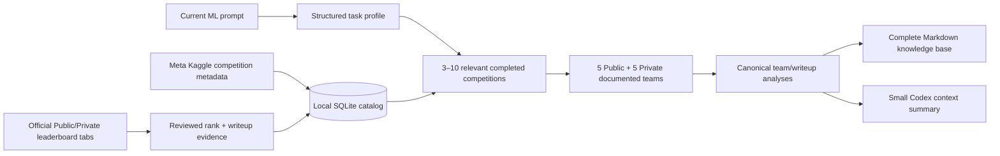

# Kaggle Solution Retriever

A context-efficient Codex skill that builds a task-specific knowledge base from verified official Kaggle Solution Writeups.

It does **not** rank notebooks by votes and it does **not** assume “top 10” means the first ten leaderboard rows. For every relevant completed competition, it independently selects:

- the five highest **Public Leaderboard** teams that published an official Solution Writeup;
- the five highest **Private Leaderboard** teams that published an official Solution Writeup.

If ranks 1–10 do not contain five writeups, selection continues below rank 10. Every selected team must have verified Public and Private ranks. Teams present in both selections share one canonical analysis.

## Why this exists

Loading a large Kaggle corpus or dozens of skills into Codex wastes context. This project separates durable research from prompt-time retrieval:



The full research stays in `kaggle_relevant_solutions_knowledge_base.md`. Codex initially reads only a bounded summary and opens full sections selectively.

## Exact policy

- Explicit invocation only.
- Completed Kaggle competitions only.
- 3–10 competitions selected by weighted structural relevance:

  | Component | Weight |
  |---|---:|
  | Task and target | 25% |
  | Modality and dataset structure | 20% |
  | Metric | 15% |
  | Validation and leakage structure | 15% |
  | Transferable modeling/features | 15% |
  | Domain | 5% |
  | Compute | 5% |

- Public and Private selections are independent and scan from rank 1 downward.
- Only official same-competition `/writeups/` links qualify.
- Both cross-leaderboard ranks and their source links are mandatory.
- Public-to-Private movement is reported for every selected team.
- Source facts, analyst inferences, and missing data remain separate.
- Full writeups and raw notebooks are never placed wholesale into Codex context.

The complete contract is in [docs/behavior-spec.md](docs/behavior-spec.md).

## Install

### Global Codex skill

Ask Codex:

```text
Use $skill-installer to install:
https://github.com/zoli801/kaggle-solution-retriever-skill/tree/v0.1.0/.agents/skills/kaggle-solution-retriever
```

Or run the bundled installer:

```bash
python3 "${CODEX_HOME:-$HOME/.codex}/skills/.system/skill-installer/scripts/install-skill-from-github.py" \
  --repo zoli801/kaggle-solution-retriever-skill \
  --ref v0.1.0 \
  --path .agents/skills/kaggle-solution-retriever \
  --dest "$HOME/.agents/skills"
```

If Codex does not immediately show the new skill, restart it.

### Repository-scoped skill

Clone this repository, or copy the skill directory into another repository:

```text
<your-repository>/.agents/skills/kaggle-solution-retriever/
```

Codex discovers repository skills from `.agents/skills` between the working directory and repository root.

## Invoke

Implicit invocation is disabled to protect context. Invoke it explicitly:

```text
$kaggle-solution-retriever

I have grouped user sessions ordered by time. The target is imbalanced binary
classification, the metric is F1, and inference must fit on one GPU.
Build the Kaggle knowledge base and use it to propose validation and models.
```

## First-time catalog bootstrap

The repository intentionally contains no copied Kaggle content and no prebuilt database. The local catalog defaults to:

```text
~/.cache/kaggle-solution-retriever/catalog.sqlite3
```

Initialize it:

```bash
SKILL_DIR="$HOME/.agents/skills/kaggle-solution-retriever"
python3 "$SKILL_DIR/scripts/catalog.py" init
python3 "$SKILL_DIR/scripts/catalog.py" status
```

Seed completed competition metadata from Meta Kaggle:

```bash
META_DIR="/absolute/path/to/meta-kaggle"
python3 "$SKILL_DIR/scripts/catalog.py" import-competitions \
  --meta-dir "$META_DIR"
```

You can download Meta Kaggle with the authenticated Kaggle CLI:

```bash
kaggle datasets download -d kaggle/meta-kaggle \
  --unzip \
  --path "$META_DIR"
```

When the skill is invoked, it ranks this compact competition catalog. If selected competitions lack current official writeup evidence, Codex follows the targeted workflow in [research-workflow.md](.agents/skills/kaggle-solution-retriever/references/research-workflow.md): inspect only those competitions’ official Public/Private tabs, create reviewed records, cache them, and rerun retrieval.

If live Kaggle access is unavailable, the skill produces a truthful partial report instead of inferring ranks or substituting popular notebooks.

## Direct CLI

From this repository:

```bash
SKILL_DIR=".agents/skills/kaggle-solution-retriever"

python3 "$SKILL_DIR/scripts/build_knowledge_base.py" \
  --prompt-file /absolute/path/to/current_task.txt \
  --task-profile /absolute/path/to/task_profile.json \
  --output /absolute/path/to/kaggle_relevant_solutions_knowledge_base.md \
  --context-output /absolute/path/to/kaggle_relevant_solutions_context.md \
  --report-output /absolute/path/to/kaggle_retrieval_report.json
```

`--task-profile` is optional. It lets Codex supply a richer structured profile than the deterministic fallback. See [task-profile-schema.md](.agents/skills/kaggle-solution-retriever/references/task-profile-schema.md).

Reviewed evidence is ingested as JSONL:

```bash
python3 "$SKILL_DIR/scripts/prepare_research_manifest.py" \
  --input /absolute/path/to/leaderboard_research.json \
  --output /absolute/path/to/reviewed_records.jsonl \
  --report /absolute/path/to/research_audit.json

python3 "$SKILL_DIR/scripts/catalog.py" ingest-jsonl \
  --input /absolute/path/to/reviewed_records.jsonl
```

The schema is documented in [catalog-schema.md](.agents/skills/kaggle-solution-retriever/references/catalog-schema.md).

## Output

The builder writes:

1. a complete Markdown knowledge base;
2. a bounded context summary;
3. an optional JSON report containing paths, competitions, relevance scores, Public/Private counts, missing evidence, recommendations, and a truthful verification flag.

The Markdown contains the required task profile, competition table, two selection tables per competition, canonical solution analyses, leaderboard shakeup, competition lessons, cross-competition synthesis, experimental plan, and deduplicated source index.

## Repository layout

```text
.agents/skills/kaggle-solution-retriever/
├── SKILL.md
├── agents/openai.yaml
├── references/
│   ├── catalog-schema.md
│   ├── operations.md
│   ├── research-workflow.md
│   ├── task-profile-schema.md
│   └── taxonomy.json
└── scripts/
    ├── build_knowledge_base.py
    ├── catalog.py
    ├── discover_candidates.py
    ├── fetch_notebook.py
    ├── kaggle_core.py
    ├── knowledge_base.py
    ├── prepare_research_manifest.py
    └── retrieve.py

docs/behavior-spec.md
tests/
```

## Test

Tests use synthetic offline data:

```bash
python3 -m compileall -q .agents/skills/kaggle-solution-retriever/scripts tests
python3 -m unittest discover -s tests -v
```

CI tests Python 3.9 and 3.13.

## Security and provenance

- Kaggle pages, writeups, notebooks, and repositories are untrusted external data.
- Retrieved code is never executed automatically.
- Notebook outputs are excluded from static excerpts and obvious secret assignments are redacted.
- Credentials, databases, downloaded content, generated knowledge bases, and IDE files are ignored by Git.
- Each admitted writeup retains its original competition, leaderboard, writeup, and code links.

## Sharing

Share the repository URL or a release-tag URL. Recipients can install it with `$skill-installer` as shown above. For stable distribution, create a GitHub release and point users to a fixed tag instead of a moving branch.

This remains a standalone Codex skill. A future universal-directory distribution can package the same skill as a plugin without changing its retrieval algorithm.

See the official [Codex skills documentation](https://learn.chatgpt.com/docs/build-skills.md) for discovery locations, explicit invocation, and distribution guidance.

## License

The original code and documentation are MIT-licensed; see [LICENSE](LICENSE).

This license does not apply to Kaggle competitions, writeups, notebooks, datasets, or linked third-party repositories. Those remain under their original terms. This project is independent and is not affiliated with or endorsed by Kaggle or Google.
