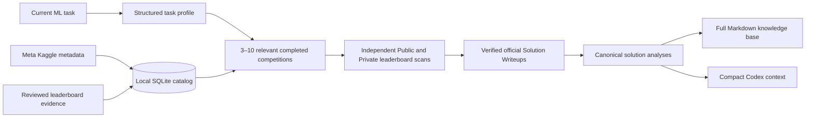

# Kaggle Solution Retriever

A Codex skill that turns verified Kaggle Solution Writeups into a compact,
task-specific knowledge base for the machine-learning problem in the current
prompt.

The skill profiles the task, retrieves 3–10 structurally relevant completed
competitions, and independently selects:

- the five highest-ranked Public Leaderboard teams with official Solution
  Writeups;
- the five highest-ranked Private Leaderboard teams with official Solution
  Writeups.

It records both leaderboard ranks, reports Public-to-Private movement, links
available notebooks and repositories, deduplicates teams selected from both
boards, and gives Codex a bounded context summary before the full research
document.

## How it works



Competition relevance uses the following default weighting:

| Component | Weight |
|---|---:|
| Task and target | 25% |
| Modality and dataset structure | 20% |
| Metric | 15% |
| Validation and leakage structure | 15% |
| Transferable modeling and features | 15% |
| Domain | 5% |
| Compute constraints | 5% |

For each selected competition, the leaderboard scan starts at rank 1 and
continues until five teams with verified official writeups are found. Public
and Private selection are performed independently, including ranks below 10
when needed to reach the fifth qualifying writeup. Each selected record keeps
its official writeup, leaderboard, competition, notebook, and repository
provenance.

The complete behavioral contract is in
[docs/behavior-spec.md](docs/behavior-spec.md).

## Install for every Codex task

Install the skill in your user-wide Codex directory:

```text
~/.codex/skills/kaggle-solution-retriever/
```

Skills stored there are available across repositories and Codex tasks on the
same computer.

### Option 1: ask Codex to install it

Paste this into any Codex task:

```text
Use $skill-installer to install:
https://github.com/zoli801/kaggle-solution-retriever-skill/tree/v0.1.1/.agents/skills/kaggle-solution-retriever
```

### Option 2: install from a terminal

macOS or Linux:

```bash
python3 "${CODEX_HOME:-$HOME/.codex}/skills/.system/skill-installer/scripts/install-skill-from-github.py" \
  --repo zoli801/kaggle-solution-retriever-skill \
  --ref v0.1.1 \
  --path .agents/skills/kaggle-solution-retriever
```

Windows PowerShell:

```powershell
python "$env:USERPROFILE\.codex\skills\.system\skill-installer\scripts\install-skill-from-github.py" `
  --repo zoli801/kaggle-solution-retriever-skill `
  --ref v0.1.1 `
  --path .agents/skills/kaggle-solution-retriever
```

### Option 3: install manually

1. Download the
   [v0.1.1 source archive](https://github.com/zoli801/kaggle-solution-retriever-skill/archive/refs/tags/v0.1.1.zip).
2. Extract the archive.
3. Copy
   `.agents/skills/kaggle-solution-retriever`
   into:

   ```text
   ~/.codex/skills/kaggle-solution-retriever
   ```

   On Windows, use:

   ```text
   %USERPROFILE%\.codex\skills\kaggle-solution-retriever
   ```

4. Start a new Codex task. Restart Codex once if the installed skill is not
   listed immediately.

### Verify the installation

macOS or Linux:

```bash
test -f "${CODEX_HOME:-$HOME/.codex}/skills/kaggle-solution-retriever/SKILL.md" \
  && echo "Kaggle Solution Retriever is installed"
```

Windows PowerShell:

```powershell
Test-Path "$env:USERPROFILE\.codex\skills\kaggle-solution-retriever\SKILL.md"
```

## Invoke the skill

Start with the skill name:

```text
$kaggle-solution-retriever

My task is multimodal classification from product photos and descriptions.
The metric is macro F1, classes are imbalanced, and inference must fit on one
GPU. Build the Kaggle knowledge base and recommend validation, models, features,
and ensembling.
```

Type `$kaggle` in the Codex composer to find the skill. The `/` prefix opens
Codex commands; `$` explicitly mentions a skill.

Explicit invocation keeps ordinary tasks lightweight: the Kaggle retrieval
workflow runs only when you request it.

## First-time catalog setup

The skill creates a local catalog at:

```text
~/.cache/kaggle-solution-retriever/catalog.sqlite3
```

Initialize it:

```bash
SKILL_DIR="${CODEX_HOME:-$HOME/.codex}/skills/kaggle-solution-retriever"

python3 "$SKILL_DIR/scripts/catalog.py" init
python3 "$SKILL_DIR/scripts/catalog.py" status
```

Install and authenticate the
[Kaggle CLI](https://github.com/Kaggle/kaggle-cli), then import completed
competition metadata from Meta Kaggle:

```bash
SKILL_DIR="${CODEX_HOME:-$HOME/.codex}/skills/kaggle-solution-retriever"
META_DIR="$HOME/.cache/kaggle-solution-retriever/meta-kaggle"

mkdir -p "$META_DIR"
kaggle datasets download -d kaggle/meta-kaggle \
  --unzip \
  --path "$META_DIR"

python3 "$SKILL_DIR/scripts/catalog.py" import-competitions \
  --meta-dir "$META_DIR"

python3 "$SKILL_DIR/scripts/catalog.py" status
```

During retrieval, Codex ranks this compact catalog first. It researches and
caches leaderboard/writeup evidence only for the selected competitions. The
targeted review procedure is documented in
[research-workflow.md](.agents/skills/kaggle-solution-retriever/references/research-workflow.md).

## Generated files

Each run can produce:

| File | Purpose |
|---|---|
| `kaggle_relevant_solutions_knowledge_base.md` | Complete task profile, competitions, selections, solution analyses, shakeup analysis, synthesis, and experiment plan |
| `kaggle_relevant_solutions_context.md` | Bounded summary designed for the Codex context window |
| `kaggle_retrieval_report.json` | Machine-readable scores, counts, evidence gaps, recommendations, and verification status |

The knowledge base separates sourced facts, analyst inferences, and missing
evidence. Public-to-Private movement is signed: a positive
`private_rank - public_rank` is a decline and a negative value is an
improvement.

## Direct command-line use

From this repository:

```bash
SKILL_DIR=".agents/skills/kaggle-solution-retriever"

python3 "$SKILL_DIR/scripts/build_knowledge_base.py" \
  --prompt-file /absolute/path/to/current_task.txt \
  --task-profile /absolute/path/to/task_profile.json \
  --output /absolute/path/to/kaggle_relevant_solutions_knowledge_base.md \
  --context-output /absolute/path/to/kaggle_relevant_solutions_context.md \
  --report-output /absolute/path/to/kaggle_retrieval_report.json
```

`--task-profile` is optional. Its schema is documented in
[task-profile-schema.md](.agents/skills/kaggle-solution-retriever/references/task-profile-schema.md).

Reviewed leaderboard evidence can be normalized and imported with:

```bash
python3 "$SKILL_DIR/scripts/prepare_research_manifest.py" \
  --input /absolute/path/to/leaderboard_research.json \
  --output /absolute/path/to/reviewed_records.jsonl \
  --report /absolute/path/to/research_audit.json

python3 "$SKILL_DIR/scripts/catalog.py" ingest-jsonl \
  --input /absolute/path/to/reviewed_records.jsonl
```

See
[catalog-schema.md](.agents/skills/kaggle-solution-retriever/references/catalog-schema.md)
for the reviewed-record format.

## Update

The installer protects an existing installation. Keep the current copy as a
backup, then install the new tag:

```bash
SKILL_ROOT="${CODEX_HOME:-$HOME/.codex}/skills"

mv "$SKILL_ROOT/kaggle-solution-retriever" \
  "$SKILL_ROOT/kaggle-solution-retriever.backup"

python3 "$SKILL_ROOT/.system/skill-installer/scripts/install-skill-from-github.py" \
  --repo zoli801/kaggle-solution-retriever-skill \
  --ref v0.1.1 \
  --path .agents/skills/kaggle-solution-retriever
```

After verifying the new version, the backup can be removed.

## Repository-scoped installation

For a skill that should appear only inside one project, copy it to:

```text
<repository>/.agents/skills/kaggle-solution-retriever/
```

This repository already uses that layout for development.

## Private distribution

For access limited to selected users:

1. Create a private GitHub repository containing the skill directory.
2. Add each recipient as a repository collaborator or grant access through a
   GitHub organization team.
3. Have each recipient authenticate Git on their computer.
4. Give them the private repository/path URL and the same `$skill-installer`
   instruction.
5. Remove repository access to revoke future downloads and updates.

Each authorized user receives a local copy in their Codex skills directory.
Keep proprietary datasets, cached Kaggle content, credentials, and generated
knowledge bases outside the distribution repository.

## Security and provenance

- External writeups, notebooks, and repositories are handled as untrusted
  research material.
- Retrieved code remains static evidence for analysis.
- Notebook outputs are excluded from excerpts and secret-like assignments are
  redacted.
- Local catalogs, downloads, credentials, and generated knowledge bases are
  excluded from Git.
- Every admitted solution retains direct source and leaderboard provenance.

## Development

Run the offline synthetic test suite:

```bash
python3 -m compileall -q .agents/skills/kaggle-solution-retriever/scripts tests
python3 -m unittest discover -s tests -v
```

CI covers Python 3.9 and 3.13.

## License

The original code and documentation are MIT-licensed; see
[LICENSE](LICENSE).

Kaggle competitions, writeups, notebooks, datasets, and linked third-party
repositories remain under their original terms. This project is independent
and is not affiliated with or endorsed by Kaggle or Google.
